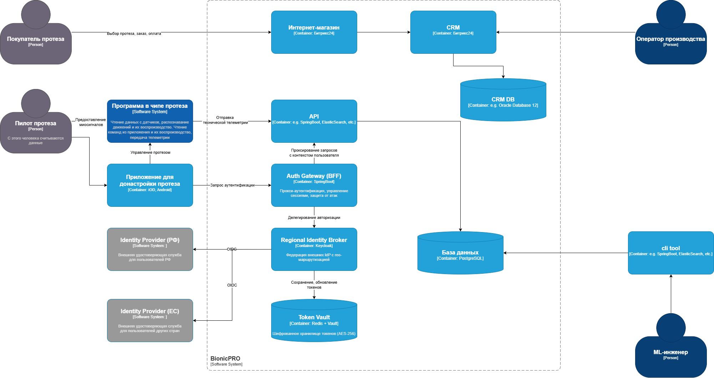
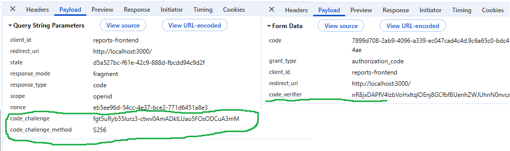
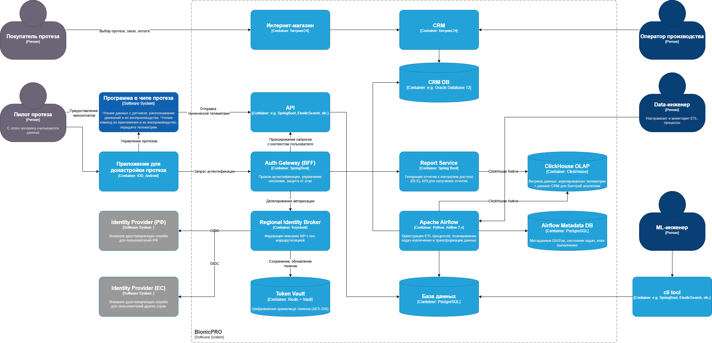
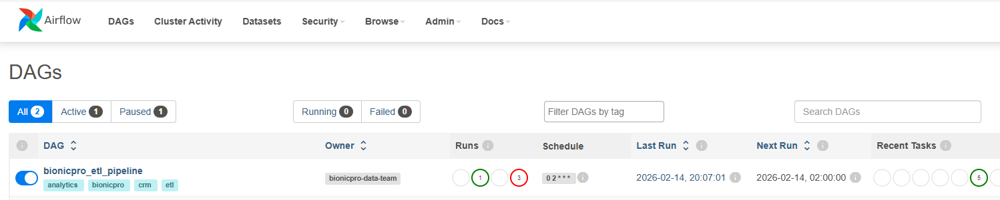
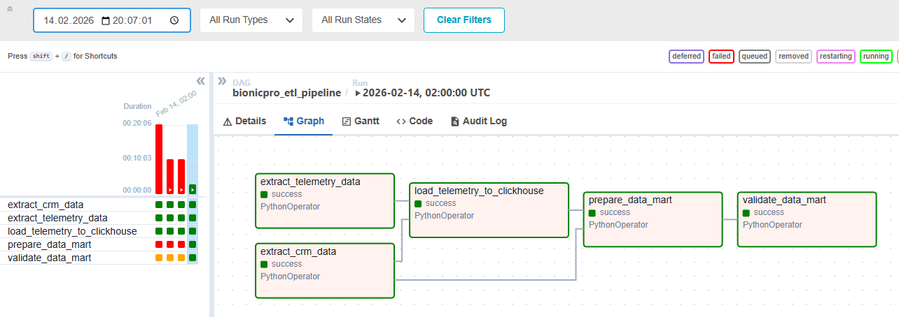
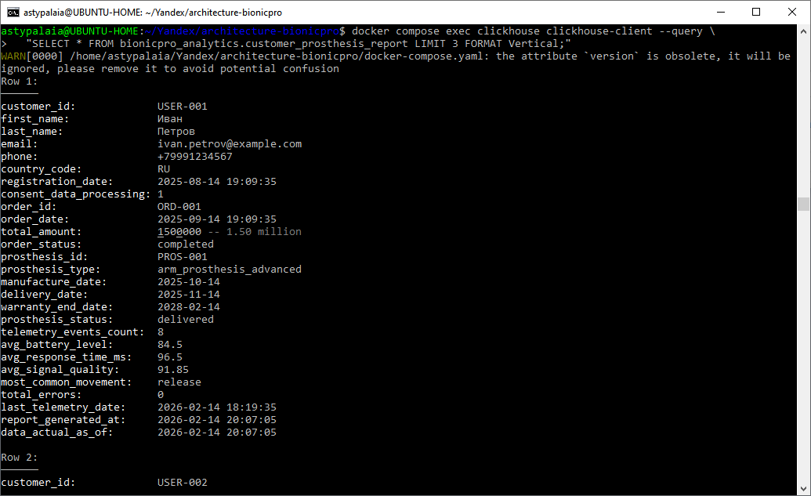

# Сдача проектной работы 9 спринта

## Задание 1. Повышение безопасности системы

### Задача 1. Аутентификация пользователей

- **Auth Gateway (BFF):** мобильное приложение теперь взаимодействует только с ним, получая сессионные куки вместо токенов
- **Regional Identity Broker:** выбирает внешний провайдер идентификации (Госуслуги для РФ, eIDAS для ЕС) в зависимости от страны пользователя
- **Token Vault:** токены хранятся ТОЛЬКО на бэкенде в зашифрованном виде (никогда не покидают сервер)

### Задача 2. Замена Code Grant на PKCE

1. Добавлен параметр `pkceMethod`: 'S256' в `initOptions` (алгоритм SHA256 для хеширования)
2. Включен Authorization Code Flow (требуется для PKCE)
3. Отключен Resource Owner Password Credentials Grant (ROPC)
4. PKCE с алгоритмом SHA256

#### Скриншоты использования PKCE
1. Запрос авторизации
   - *GET /auth - Отправка code_challenge с методом S256*

2. Получение токена
   - *POST /token - Верификация с помощью code_verifier*

## Задание 2. Разработка сервиса отчётов

### Задача 1. Создать архитектуру решения для подготовки и получения отчётов

### Задача 2. Разработать Airflow DAG и настроить его на запуск по расписанию

**Airflow создан в** [папке](airflow)

1. Ручной запуск DAG 

2. DAG graph view

3. Запрос отчета

