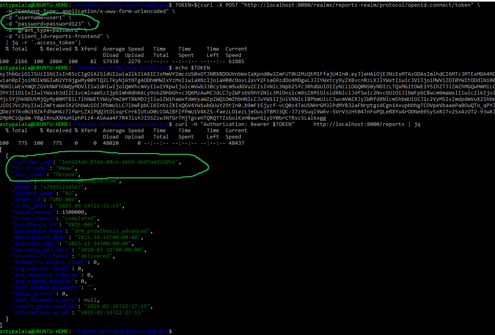
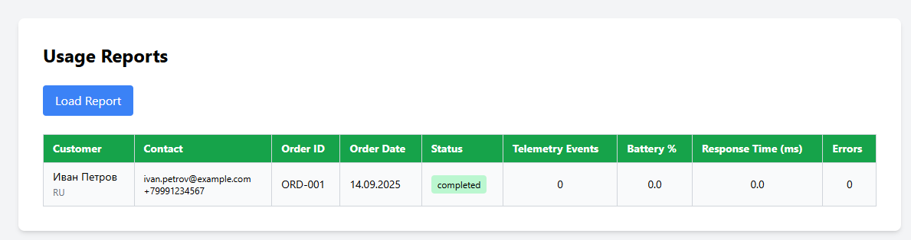

# Сдача проектной работы 9 спринта

## Задание 1. Повышение безопасности системы

### Задача 1. Аутентификация пользователей

- **Auth Gateway (BFF):** мобильное приложение теперь взаимодействует только с ним, получая сессионные куки вместо токенов
- **Regional Identity Broker:** выбирает внешний провайдер идентификации (Госуслуги для РФ, eIDAS для ЕС) в зависимости от страны пользователя
- **Token Vault:** токены хранятся ТОЛЬКО на бэкенде в зашифрованном виде (никогда не покидают сервер)


### Задача 2. Замена Code Grant на PKCE

1. Добавлен параметр `pkceMethod`: 'S256' в `initOptions` (алгоритм SHA256 для хеширования)
2. Включен Authorization Code Flow (требуется для PKCE)
3. Отключен Resource Owner Password Credentials Grant (ROPC)
4. PKCE с алгоритмом SHA256

#### Скриншоты использования PKCE
1. Запрос авторизации
   - *GET /auth - Отправка code_challenge с методом S256*

2. Получение токена
   - *POST /token - Верификация с помощью code_verifier*


## Задание 2. Разработка сервиса отчётов

### Задача 1. Создать архитектуру решения для подготовки и получения отчётов


### Задача 2. Разработать Airflow DAG и настроить его на запуск по расписанию

**Airflow создан в** [папке](airflow)


#### Запуск локально

Из корня репозитория:

```bash
docker compose up -d
#
# подождать завершения инициализации :-)
# затем создать подключения

chmod +x airflow/setup-airflow-connections.sh
airflow/setup-airflow-connections.sh
````

После старта стенда:

1. Открыть UI Airflow: `http://localhost:8081`
   Логин/пароль создаются автоматически: `admin / admin`.

2. В списке DAG’ов найти `bionicpro_etl_pipeline` и включить (тумблер в состояние **On**).

3. Для проверки работы можно вручную запустить DAG через кнопку **Trigger DAG** в UI.

#### Проверка результата

```bash
docker compose exec clickhouse clickhouse-client --query \
  "SELECT * FROM bionicpro_analytics.customer_prosthesis_report LIMIT 3 FORMAT Vertical;"
```

#### Скриншоты

1. Ручной запуск DAG 


2. DAG graph view


3. Запрос отчета


### Задача 3. Создайте бэкенд-часть приложения для API
### Задача 4. Реализуйте ограничение доступа к эндпоинту отчётности

**Маппинг пользователей для справки**

| Keycloak Username | Keycloack UUID | Имя в CRM |
|-------------------|----------------|-----------|
| user1      | 1ebd24ab-87e6-40ce-a1bd-ded5aa9d205e | Иван Петров |
| user2      | 61c813cd-2251-4a29-9415-57fec09a8c8f | Мария Сидорова |
| prothetic1 | d0ec1834-b77d-4e3a-9ba5-1ce10ac6855c | Сергей Протезов |
| prothetic2 | 5fb8041c-4e30-41ea-bd32-d075859100b8 | Елена Тестова |
| prothetic3 | 043f5200-eab2-4d13-9c7e-01b84ba26d94 | Дмитрий Калибров |
| admin1     | 6e102ed8-120e-4ef0-a20c-1b4edfc54702 | НЕ в CRM |


**Backend создан в** [папке](airflow)

#### Скриншоты запросов к Backend

1. Получить токен авторизации
2. Убедиться, что токен получен
3. Сделать запрос к /reports с этим токеном
4. Убедиться, что в отчете получены данные только "про себя"




### Задача 5. Добавьте в UI кнопку получения отчёта и вызова эндпоинта его генерации


**Frontend обновлен в** [папке](frontend)

#### Скриншот построения отчета




